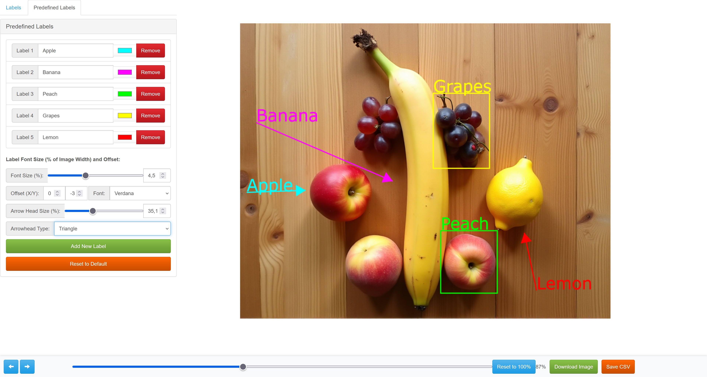

# Simple? Label Bounding Box

## Description
Well, I could not find any annotators that would be fast to use and let me download the image with the bounding boxes AND labels. So I forked this project to improve it for my needs with the helps of ChatGPT. I'm not a coder.
Now it does arrows too!



For windows, install Python, do the venv thing:
```
python -m venv env
```
Activate the venv thing:
```
env\Scripts\activate
```

## Install
* Install Flask
```
pip install Flask
```

## Getting started
* cd into this directory after cloning the repo
* start the app
Example:
```
python app.py "D:\YourFolderWithImages"
```
You don't need to specify a output file, it will check and create automatically on the loaded folder.

* open http://127.0.0.1:5000/tagger in your browser

## Output
* The output is to a csv file with the following fields
    * *image* - image the bounding box is associated with
    * *id* - id of the bounding box within the image
    * *name* - Label name of the bounding box
    * *xMin* - min x value of the bounding box
    * *xMax* - max x value of the bounding box
    * *yMin* - min y value of the bounding box
    * *yMax* - max y value of the bounding box
    * *Color* - hex clor value of the bounding box
    * *Type* - Box or Arrow annotation

## What is new to my project:

* Arrows!
* Colors
* Labels on top of each bounding box
* Label cycling for fast labeling images in the same order
* Predefined labels and colors
* You can zoom with slider or mouse wheel.
* You can drag the image through the canvas and zoom freely
* Button to reset zoom to 100% (and also reset image back to starting position)
* Button to save image (it will save at 100% zoom with bounding boxes and Labels, this is what I wanted for this project)
* CSV is automatically created on the image directory as annotations.cvs with all images annotations as you go. This is a bonus, I don't have a use for this, but it is used to save and restore the session.
* Save and restoring working session.
* Next and previously with persistent annotations.
* Button to save CSV (it will get a download copy of the CVS)
* A new tab to change (and it will persist) the rotating predefined labels and predefined colors (add, remove, change colors)
* On the "Predefined labels" tab you can find some settings: Label font size %, Label Offset, Label Font Style, Reset to Defaults, Arrow head size, Arrow type (standard or triangle).
* A crosshair while hoovering the image.


## What is Missing?
* First screen sometimes is blank, you need to move to the next image.
* Drag and Drop with a shadow to create bounding boxes and also keep the two coordinates point click.
* Maybe fix the goodbye screen at the end.